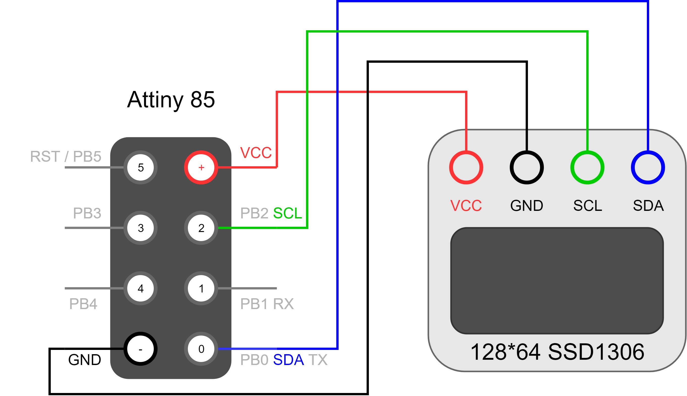
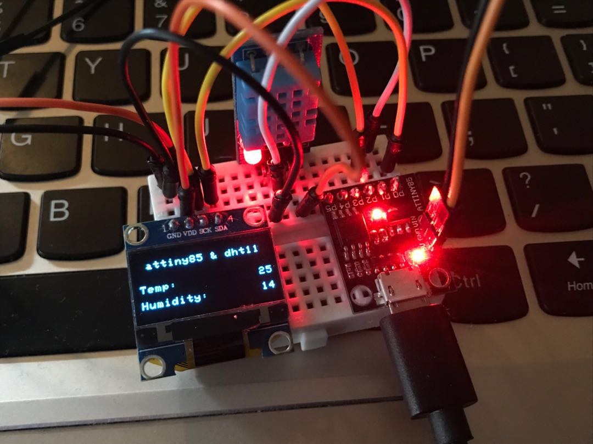

oled的连接图:

dht11的data接PB0，vcc接vcc，gnd接gnd

演示图：

需要下载以下2个lib

https://github.com/adafruit/DHT-sensor-library
https://github.com/adafruit/Adafruit_Sensor

到 C:\Program Files (x86)\Arduino\libraries 目录

